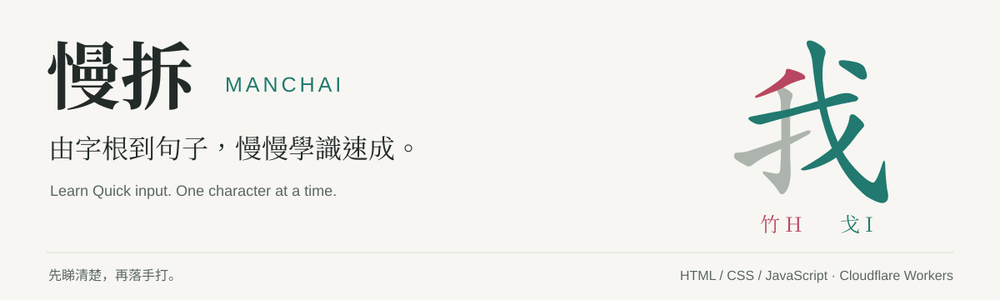
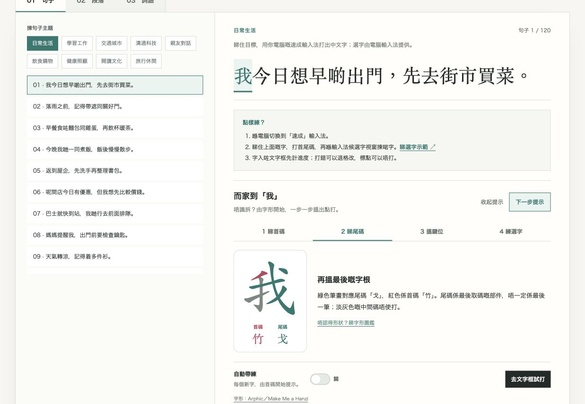
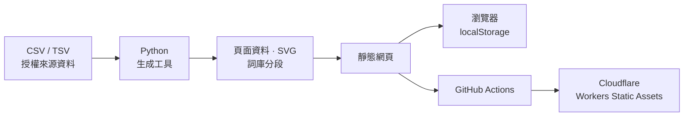

<p align="center">
  
</p>

<p align="center">
  <a href="https://github.com/hiyoman1167/manchai/actions/workflows/deploy.yml"></a>
  
  
</p>

<p align="center">
  <a href="https://learn.manchai.workers.dev/">體驗網站</a> ·
  <a href="https://learn.manchai.workers.dev/learn">入門課程</a> ·
  <a href="docs/development.md">開發指南</a> ·
  <a href="docs/sources.md">資料與授權</a>
</p>

## 先學識點拆，再練到識打。

**慢拆（Manchai）** 係為速成新手而設嘅繁體中文學習網站。由認字根、取首尾碼到選字，逐步教你用速成打出日常句子。答案需要時先揭開，唔使靠估或者死記隨機字。

無廣告、免帳戶、唔使後端。日式留白配搭紅色首碼、綠色尾碼，進度自動儲存喺瀏覽器。



*正式網站截圖。紅色代表首碼，綠色代表尾碼；同一組顏色貫穿課程同打字提示。*

## 學到啲乜

| 學習階段 | 內容 |
| :--- | :--- |
| **認字根** | 24 個基本字根、191 幅輔助字形，對照鍵位同例字。 |
| **逐字拆碼** | 25 組課程、1,011 個字，由入門拆碼到生活主題。 |
| **真正打字** | 120 句生活情境、30 篇完整段落，使用電腦本身嘅速成輸入法。 |
| **延伸練習** | 410,945 個可搜尋詞語及短語，亦可切換逐字拆碼模式。 |

- **四步提示** — 睇首碼 → 睇尾碼 → 搵鍵位 → 練選字；示範選字唔會當成真正打字完成。
- **彩色筆畫** — 1,146 個字有本機 SVG 圖解；未可靠對應嘅部件會保留原色並說明。
- **接住上次練** — 記住完成紀錄、練習位置、已打啱嘅部分同「自動帶練」設定。
- **按需要載入** — 詞庫分成 42 部分，每批最多 10,000 詞；搜尋全詞庫時會顯示載入進度。

### 第一次用

1. 去[入門課程](https://learn.manchai.workers.dev/learn)，先睇字根、首尾取碼同選字示範。
2. 練一小組字根，再試逐字課程；卡住先揭下一步提示。
3. 去[打字練習](https://learn.manchai.workers.dev/practice)，切換電腦嘅速成輸入法，由一句開始。

真正打字由系統輸入法提供候選字；網站核對已輸入嘅中文，唔會代你選字。標點可以略過，打錯可以退格修改，貼上唔計練習。網站無法偵測你目前使用邊種輸入法。

## Quick start

需要 **Node.js 22** 同 **Python 3**。Node.js 版本同 GitHub Actions 一致。

```bash
git clone https://github.com/hiyoman1167/manchai.git
cd manchai
npm ci
npm run dev
```

開啟 **[localhost:4173](http://localhost:4173/)**。彩色 SVG 同詞庫分段需要經本機伺服器載入。

| 指令 | 用途 |
| :--- | :--- |
| `npm run dev` | 啟動本機網站。 |
| `npm test` | 檢查資料、輸入法組字、拆碼選字，以及儲存／恢復進度。 |
| `npm run build` | 重建資料，將公開網站檔案輸出到 `dist/`。 |
| `npm run deploy` | 建置並透過 Wrangler 發佈到 Cloudflare。 |

## 工程設計

**HTML + CSS + Vanilla JavaScript**，使用 Cloudflare Workers Static Assets 提供網頁。Python 負責資料生成，Node.js 負責測試，正式網站唔需要資料庫。



| 位置 | 職責 |
| :--- | :--- |
| `index.html` / `learn.html` / `roots.html` / `practice.html` | 學習路線、課程、字形圖鑑、打字練習。 |
| `shared.js` / `script.js` / `extended.js` | 共用字根與儲存、課程流程、閱讀與詞語練習。 |
| `typing-core.js` / `glyph-diagrams.js` | 中文輸入核對、共用彩色拆碼圖解。 |
| `data/` / `tools/` | 可編輯來源資料、生成工具及已生成資料。 |
| `assets/` / `licenses/` | 本機字形素材、上游授權與作者聲明。 |
| `tests/` / `.github/workflows/` | 功能檢查及自動部署。 |

### 部署與維護

推送到 `main` 會觸發 **安裝 → 測試 → 建置 → 部署**，測試通過先上線。亦可從 GitHub Actions 手動執行。

- [開發與資料更新](docs/development.md) — 本機開發、翻譯 CSV、詞庫與字形重建。
- [部署與搜尋設定](docs/operations.md) — Cloudflare secrets、發佈流程、canonical 同 sitemap。
- [內容來源與授權](docs/sources.md) — Unicode、Rime、字形來源、覆蓋範圍及使用限制。
- [介面設計](DESIGN.md) — 配色、學習流程及響應式設計。

## 貢獻

歡迎提交課程錯字、拆碼問題同使用體驗嘅 [Issue](https://github.com/hiyoman1167/manchai/issues)，或者提出 PR。回報拆碼問題時，請附中文字、預期字碼同所用輸入法。

介面翻譯要先改 **CSV 來源**再執行生成工具；新增練習內容亦要重建資料並通過 `npm test`。請保留第三方作者及授權聲明。

**進度係本機紀錄。** 同一瀏覽器、同一網站網址先可以恢復；唔會跨裝置同步，清除網站資料會移除紀錄。詞庫係練習資料，唔係完整語文詞典；同碼候選字嘅教學排序可能同真實輸入法唔同。
